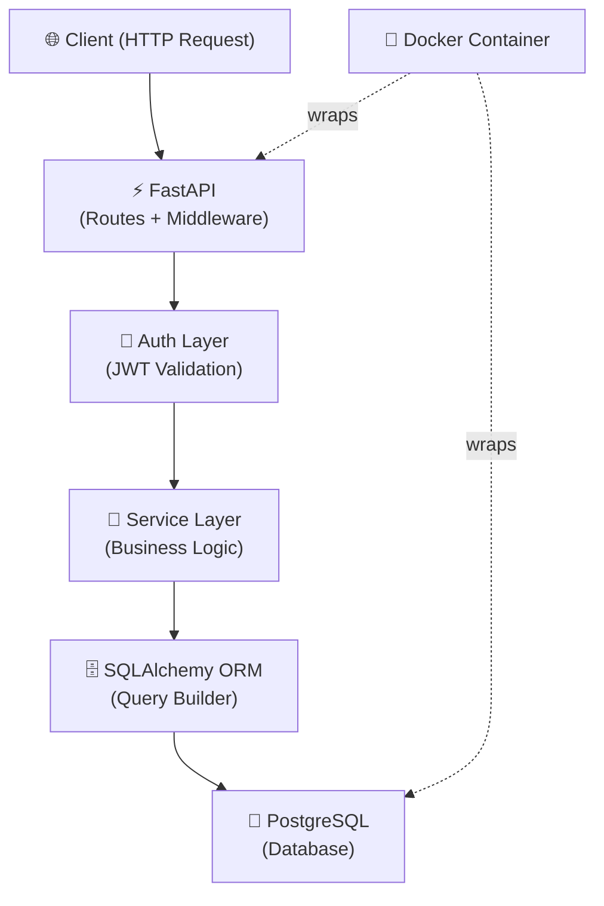

<div align="center">

<!-- Animated Typing Banner -->
[](https://git.io/typing-svg)

<br/>

**Building scalable APIs with Python, FastAPI, PostgreSQL & AI Integration.**

<br/>

<!-- Badges Row -->
[](https://github.com/yogesh-kumar-sharma)
[](https://github.com/yogesh-kumar-sharma)
[](https://github.com/yogesh-kumar-sharma)

<br/>

<!-- Trophy Section -->
[](https://github.com/ryo-ma/github-profile-trophy)

</div>

---

## 🧑‍💻 About Me

```python
class BackendDeveloper:
    name        = "Yogesh Kumar Sharma"
    role        = "Python Backend Developer | FastAPI Specialist"
    education   = "MCA — AI & ML | Galgotias University"
    location    = "Greater Noida, India"

    focus = [
        "RESTful API Design & Architecture",
        "Secure JWT Authentication Systems",
        "PostgreSQL Relational Database Design",
        "Docker-based Application Deployment",
        "Async Backend Systems with FastAPI",
        "AI API Integration & RAG Applications",
        "Clean, Maintainable, Production-ready Code",
    ]

    currently_learning = ["Redis", "Celery", "Alembic", "Nginx", "CI/CD", "GitHub Actions", "Microservices", "WebSockets"]
    goal = "Land a Backend Developer role building impactful, scalable products"
```

> I'm a backend-focused developer who thrives at the intersection of **clean architecture** and **real-world problem solving**. I build secure, documented, containerized APIs — and I'm constantly pushing toward production-grade engineering.

---

## 🛠️ Tech Stack

### Languages


### Backend Framework


### Databases


### ORM & Auth


### DevOps & Tools


### API Tools


### Testing


### 🔭 Currently Learning


---

## 🗺️ Backend Developer Roadmap

> My progress through the Python backend ecosystem — from fundamentals to production systems.

| # | Topic | Status | Notes |
|---|-------|--------|-------|
| 01 | Python (Core + OOP) | ✅ **Strong Foundation** | Classes, decorators, type hints, modules |
| 02 | SQL & Relational DB Design | ✅ **Strong Foundation** | Schema design, joins, indexing, normalization |
| 03 | REST API Design | ✅ **Hands-on Experience** | Resource modeling, status codes, versioning |
| 04 | PostgreSQL | ✅ **Hands-on Experience** | Queries, constraints, relationships, used in projects |
| 05 | FastAPI | ✅ **Hands-on Experience** | Routers, dependency injection, middleware |
| 06 | JWT Authentication | ✅ **Hands-on Experience** | Access tokens, password hashing, protected routes |
| 07 | SQLAlchemy ORM | ✅ **Hands-on Experience** | Models, sessions, relationships, used in projects |
| 08 | Docker & Containerization | ✅ **Comfortable Working With** | Dockerfile, Compose, containerized deployments |
| 09 | Async Endpoints (AsyncIO) | ✅ **Comfortable Working With** | Async handlers, background tasks in FastAPI |
| 10 | Pytest & API Testing | 🔄 **Currently Learning Advanced Concepts** | Unit tests, fixtures, test clients |
| 11 | Cloud Deployment | 🔄 **Currently Learning Advanced Concepts** | AWS certified, exploring VPS deployment |
| 12 | AI API Integration | 🔄 **Currently Learning Advanced Concepts** | OpenAI APIs, exploring LangChain |
| 13 | Alembic (DB Migrations) | 🔄 **Currently Learning Advanced Concepts** | Schema versioning, migration scripts |
| 14 | Redis & Caching | 📌 **Next Up** | Cache layers, session storage |
| 15 | Celery & Task Queues | 📌 **Next Up** | Background workers, scheduling |
| 16 | Nginx & Reverse Proxy | 📌 **Next Up** | Load balancing, SSL termination |
| 17 | CI/CD & GitHub Actions | 📌 **Next Up** | Automated testing & deployment pipelines |
| 18 | WebSockets & Real-time | 📌 **Planned** | Chat APIs, live notifications |
| 19 | System Design | 📌 **Planned** | Scalability, CAP theorem, design patterns |
| 20 | Microservices Architecture | 📌 **Planned** | Service decomposition, API Gateway |
| 21 | RAG-based Backend Apps | 📌 **Planned** | Document Q&A, vector search APIs |

---

## 🚀 Featured Projects

> Real projects built and pushed to GitHub. Each follows clean architecture with Docker support, Swagger docs, and a `.env.example`.

| Project | Stack | Key Features | Links |
|---------|-------|--------------|-------|
| **📝 Blog Platform API** | FastAPI · PostgreSQL · JWT · SQLAlchemy · Docker | JWT auth, CRUD posts/comments, relational schema, Dockerized | [GitHub](https://github.com/yogesh-kumar-sharma) · [Docs](#) |
| **✅ Task Management API** | FastAPI · PostgreSQL · AsyncIO · Docker | Task CRUD, status-based filtering, async endpoints, Dockerized | [GitHub](https://github.com/yogesh-kumar-sharma) · [Docs](#) |

> 🔗 *Update `[GitHub]` links above with your actual repository URLs once they are published.*

---

## 🧪 Planned Projects

> Projects I'm actively designing or will build next — not yet live on GitHub.

| Project | Planned Stack | Goal |
|---------|--------------|------|
| **🔐 Authentication Service** | FastAPI · JWT · bcrypt · PostgreSQL | Standalone auth microservice with token refresh |
| **📓 Notes API** | FastAPI · SQLite · SQLAlchemy · Pydantic | Lightweight CRUD app focused on clean Pydantic schemas |
| **🤖 AI Writing Assistant API** | FastAPI · OpenAI API · PostgreSQL · Docker | AI content generation with prompt templates & history |
| **🔍 RAG Document Chat API** | FastAPI · LangChain · PostgreSQL · pgvector | Document ingestion + vector-search Q&A backend |
| **🍳 Recipe API** | FastAPI · PostgreSQL · SQLAlchemy · Docker | Ingredient search, dietary filters, nutritional tagging |
| **📱 Social Media Backend** | FastAPI · PostgreSQL · JWT · Async · Docker | User profiles, posts, follow/feed system |

---

## 📊 GitHub Analytics

<div align="center">


<br/><br/>


<br/><br/>

[](https://github.com/ashutosh00710/github-readme-activity-graph)

</div>

---

## 🎯 What I Focus On

<table>
<tr>
<td width="50%">

**Backend Engineering**
- 🔗 RESTful API design with FastAPI
- 🔒 Secure authentication (JWT + bcrypt)
- 🗄️ PostgreSQL schema design & optimization
- ⚡ Async endpoints & background tasks

</td>
<td width="50%">

**Architecture & Ops**
- 🐳 Docker-first deployment approach
- 📐 Clean, modular code structure
- 📈 API performance & scalability
- 🤖 AI-powered backend services

</td>
</tr>
</table>

---

## 🏭 Production Practices

> Patterns and techniques I apply consistently across every API I build.

<table>
<tr>
<td width="50%">

**Security & Auth**
- 🔐 JWT-based authentication (access tokens)
- 🔒 Password hashing with **bcrypt**
- 🌍 Environment variables via `.env` + `python-dotenv`
- 🚫 No secrets in source code or commits

</td>
<td width="50%">

**Architecture & Quality**
- 🏗️ Layered architecture: routes → services → models
- ✅ Input validation with **Pydantic** schemas
- 🐳 Dockerized apps with `docker-compose`
- 📄 Auto-generated **Swagger / OpenAPI** docs
- ⚠️ Structured error handling with HTTP exceptions
- 📋 Basic request/response logging

</td>
</tr>
</table>

---

## ⚙️ API Features I Implement

> Standard capabilities built into my FastAPI projects.

| Feature | Implementation |
|---------|---------------|
| **CRUD Operations** | Full Create / Read / Update / Delete endpoints |
| **Pagination** | `limit` + `offset` query params on list endpoints |
| **Filtering** | Query parameter-based field filtering |
| **Search** | Keyword search on relevant text fields |
| **Authentication** | JWT Bearer token via `OAuth2PasswordBearer` |
| **Authorization** | Role/ownership checks on protected routes |
| **Request Validation** | Pydantic models on all request bodies |
| **Response Models** | Typed Pydantic response schemas |
| **Async Endpoints** | `async def` handlers where applicable |

---

## 🏗️ Backend Architecture

> A typical request flow through my FastAPI applications.



---

## 📚 Current Learning Journey

> What I'm actively studying and building toward right now.

| Technology | Why I'm Learning It | Status |
|------------|---------------------|--------|
| **Alembic** | Database schema migrations for production apps | 🔄 In Progress |
| **Redis** | Caching, session management, rate limiting | 🔄 In Progress |
| **Celery** | Async task queues and background job processing | 📌 Starting Soon |
| **Nginx** | Reverse proxy, static file serving, SSL termination | 📌 Starting Soon |
| **GitHub Actions** | Automated CI/CD pipelines for backend projects | 📌 Starting Soon |
| **CI/CD Principles** | Build → Test → Deploy automation workflows | 📌 Starting Soon |
| **WebSockets** | Real-time features (chat, notifications) with FastAPI | 📌 Planned |
| **System Design** | Scalability, availability, distributed system patterns | 📌 Planned |
| **Microservices** | Service decomposition, inter-service communication | 📌 Planned |

---

## 📁 Repository Standards

Every repository I publish follows a consistent quality bar:

```
project-name/
├── app/
│   ├── api/          # Route handlers
│   ├── core/         # Config, security, dependencies
│   ├── models/       # SQLAlchemy models
│   ├── schemas/      # Pydantic schemas
│   └── services/     # Business logic
├── tests/            # Pytest test suite
├── .env.example      # Environment variable template
├── docker-compose.yml
├── Dockerfile
├── requirements.txt
└── README.md         # Setup guide + API docs
```

✅ Clean folder structure &nbsp;·&nbsp; ✅ README documentation &nbsp;·&nbsp; ✅ `.env.example` included  
✅ Docker support &nbsp;·&nbsp; ✅ Swagger/OpenAPI docs &nbsp;·&nbsp; ✅ Meaningful commit history

---

## 🎯 2026 Goals

- [ ] Build **15+ production-ready** backend projects
- [ ] Master the full **FastAPI ecosystem** (middleware, lifespan, advanced deps)
- [ ] Learn and deploy with **Redis + Celery**
- [ ] Deploy multiple APIs to **cloud infrastructure**
- [ ] Build **3+ AI-integrated backend services**
- [ ] Develop solid **system design** fundamentals
- [ ] Make meaningful **open source contributions**
- [ ] Land a **Python Backend Developer** role at a product-first company

---

## 🤝 Connect With Me

<div align="center">

<!-- TODO: Replace YOUR_LINKEDIN_HANDLE with your actual LinkedIn username -->
[](https://linkedin.com/in/YOUR_LINKEDIN_HANDLE)
[](https://github.com/yogesh-kumar-sharma)
[](mailto:ykumar0052@gmail.com)
<!-- TODO: Replace # with your actual portfolio URL -->
[](#)
<!-- TODO: Replace YOUR_LEETCODE_USERNAME with your actual LeetCode username -->
[](https://leetcode.com/YOUR_LEETCODE_USERNAME)
<!-- TODO: Replace YOUR_HACKERRANK_USERNAME with your actual HackerRank username -->
[](https://hackerrank.com/YOUR_HACKERRANK_USERNAME)

> 📝 *Update `YOUR_LINKEDIN_HANDLE`, `YOUR_LEETCODE_USERNAME`, `YOUR_HACKERRANK_USERNAME`, and Portfolio link with your actual profiles.*

</div>

---

<div align="center">

*Open to backend developer roles — Python, FastAPI, PostgreSQL, Docker, AI APIs.*  
*Reach me at [ykumar0052@gmail.com](mailto:ykumar0052@gmail.com)*

<br/>

> *"Great backend systems are invisible to users — but essential to every great product."*

<br/>

⭐ **If you find my work valuable, a star goes a long way!**

</div>
